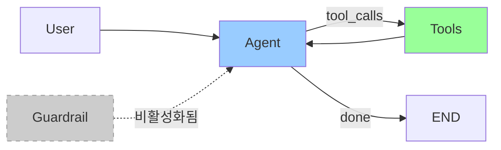
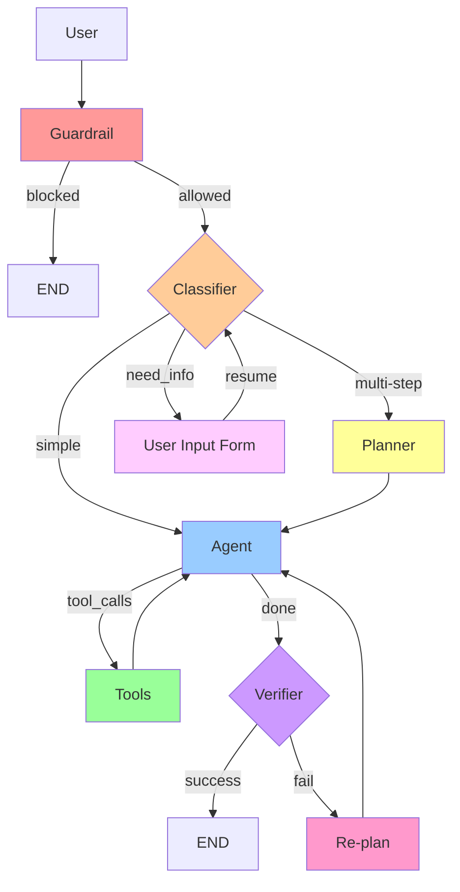
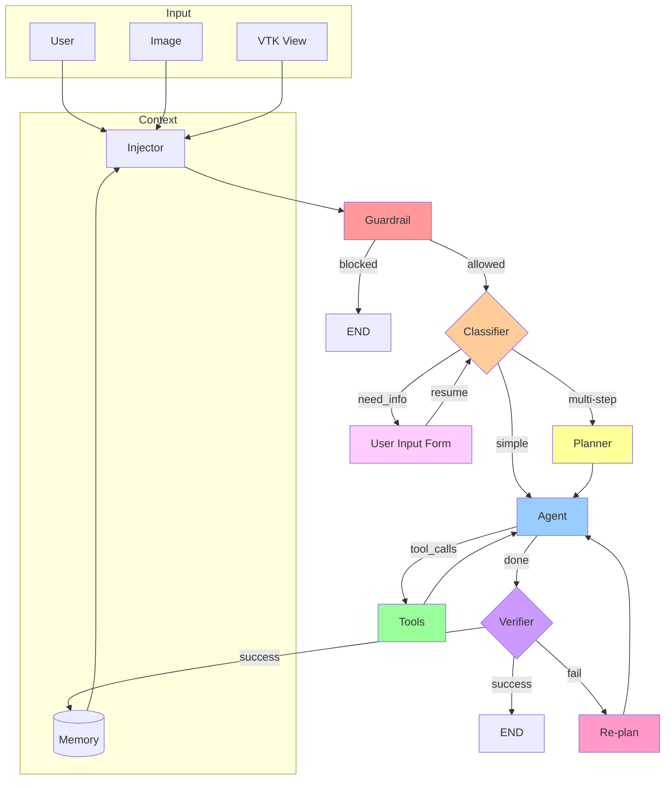
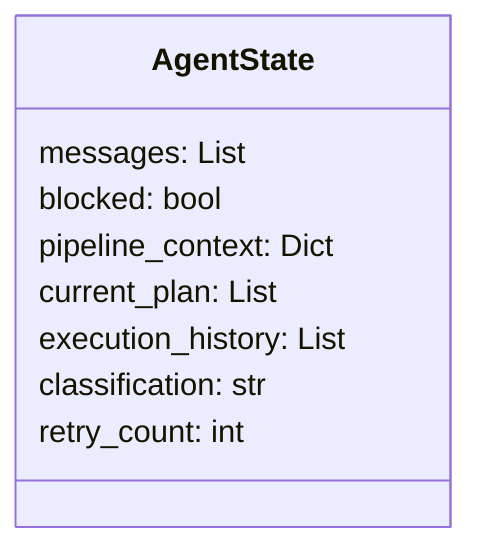

# Agent Architecture Design

## 현재 구조 (Current)

> ⚠️ **Guardrail 임시 비활성화** (2025-01-15): 판단 기준이 애매하여 바이패스됨. `src/python/agent/graph.py` 참조.

---

## 목표 구조 (Target - Phase 1~3)

---

## Phase 4: Multi-Modal & Memory

---

## 노드 역할

| Node | 역할 |
|------|------|
| ~~**Guardrail**~~ | ⚠️ **비활성화됨** - 보안/스팸 필터링 |
| **Classifier** | 요청 복잡도 분류 (simple/multi-step) |
| **Planner** | 멀티스텝 작업 계획 수립 |
| **Agent** | 도구 호출 및 응답 생성 |
| **Tools** | 실제 기능 실행 |
| **Verifier** | 결과 검증 |
| **Re-plan** | 실패 시 대안 수립 |
| **Injector** | 현재 상태/이미지 주입 |
| **Memory** | 장기 기억 (RAG) |

---

## State 구조

