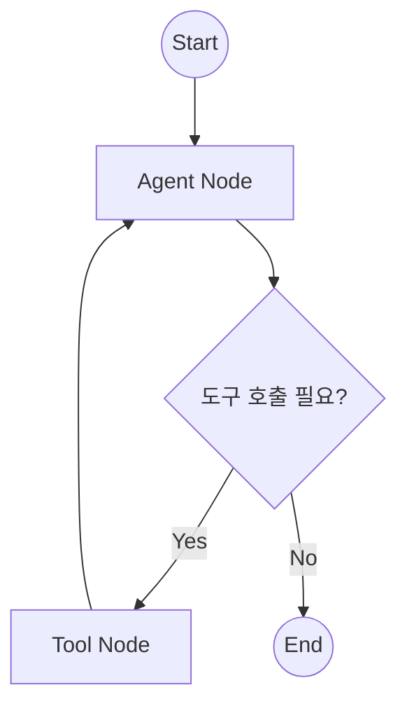
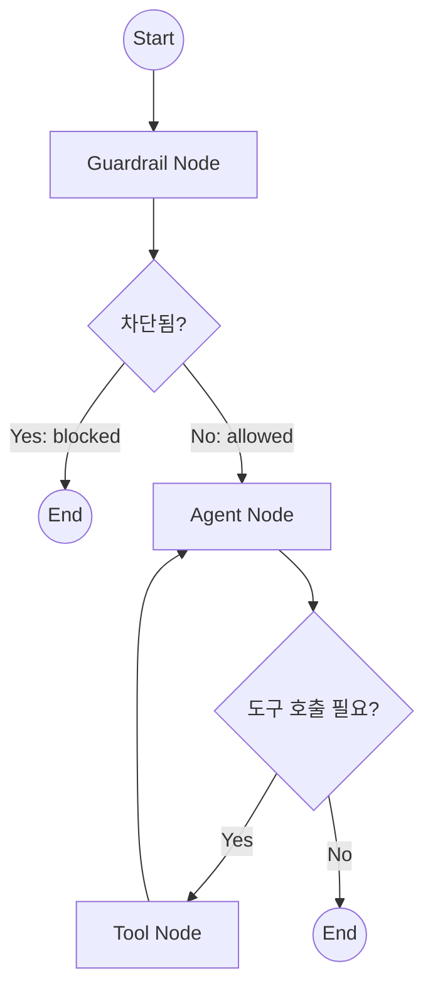

# 15. LLM 에이전트 아키텍처 상세

## 15.1 개요

SA-Agent는 **LangGraph**를 사용하여 LLM 기반 에이전트를 구현합니다. 사용자의 자연어 요청을 분석하고, 도구를 호출하여 VTK 시각화 작업을 수행합니다.

### 15.1.1 기술 스택

| 컴포넌트 | 라이브러리 | 용도 |
|----------|------------|------|
| LLM 프레임워크 | LangChain | 모델 추상화, 도구 정의 |
| 그래프 워크플로 | LangGraph | 상태 기계, 노드 라우팅 |
| 메모리 관리 | MemorySaver | 대화 히스토리 저장 |
| 모델 | GPT-4o-mini (기본) | 자연어 이해 및 생성 |

---

## 15.2 그래프 워크플로 구조

### 15.2.1 현재 활성화된 워크플로



### 15.2.2 전체 워크플로 (Guardrail 포함 - 비활성화됨)



> [!NOTE]
> Guardrail 노드는 2025-01-15 기준으로 **비활성화**되어 있습니다.
> 필터링 기준이 모호하여 일시적으로 비활성화되었습니다.

---

## 15.3 상태 (AgentState)

### 15.3.1 상태 정의

```python
from typing import TypedDict, Annotated, Any
from langgraph.graph.message import add_messages

class AgentState(TypedDict):
    messages: Annotated[list, add_messages]  # 대화 메시지 목록
    pipeline_context: dict[str, Any]         # 파이프라인 컨텍스트
    blocked: bool                            # 차단 여부 (Guardrail용)
```

### 15.3.2 상태 필드 설명

| 필드 | 타입 | 설명 |
|------|------|------|
| `messages` | `list[BaseMessage]` | HumanMessage, AIMessage, SystemMessage 등 |
| `pipeline_context` | `dict` | 현재 파이프라인 상태 (선택 아이템 등) |
| `blocked` | `bool` | Guardrail에서 차단 시 True |

### 15.3.3 메시지 누적

```python
# add_messages 어노테이션은 메시지를 덮어쓰지 않고 누적
# 예: return {"messages": [new_message]}
# 결과: state["messages"]에 new_message 추가됨
```

---

## 15.4 노드 정의

### 15.4.1 Agent Node

```python
def create_agent_node(model, tools: list):
    model_with_tools = model.bind_tools(tools)
    
    def agent_node(state: AgentState) -> dict:
        messages = state["messages"]
        
        # 시스템 프롬프트 삽입
        if not messages or messages[0].type != "system":
            messages = [SystemMessage(content=SYSTEM_PROMPT)] + list(messages)
        
        # LLM 호출
        response = model_with_tools.invoke(messages)
        return {"messages": [response]}
    
    return agent_node
```

**역할:**
- 시스템 프롬프트와 함께 메시지를 LLM에 전달
- LLM 응답을 상태에 추가
- 도구 호출이 필요하면 `tool_calls` 포함된 응답 반환

### 15.4.2 Tool Node

```python
from langgraph.prebuilt import ToolNode

tool_node = ToolNode(tools)
```

**역할:**
- Agent가 요청한 도구 호출 실행
- 도구 결과를 ToolMessage로 반환
- 결과를 Agent에게 다시 전달

### 15.4.3 Guardrail Node (비활성화됨)

```python
def create_guardrail_node(model, tools: list):
    structured_model = model.with_structured_output(GuardrailDecision)
    
    def guardrail_node(state: AgentState) -> dict:
        # 마지막 사용자 메시지 검사
        last_message = state["messages"][-1]
        
        # 구조화된 판단 요청
        decision = structured_model.invoke([
            SystemMessage(content=GUARDRAIL_PROMPT),
            *state["messages"]
        ])
        
        if decision.decision == "blocked":
            return {
                "messages": [AIMessage(content="차단 메시지")],
                "blocked": True
            }
        
        return {"blocked": False}
    
    return guardrail_node
```

**역할:**
- 스팸, 보안 위협, 관련 없는 요청 필터링
- 차단 시 즉시 종료

---

## 15.5 라우팅 함수

### 15.5.1 should_continue

```python
def should_continue(state: AgentState) -> Literal["tools", "end"]:
    messages = state["messages"]
    last_message = messages[-1]
    
    # tool_calls가 있으면 도구 노드로
    if hasattr(last_message, "tool_calls") and last_message.tool_calls:
        return "tools"
    
    # 없으면 종료
    return "end"
```

### 15.5.2 route_after_guardrail (비활성화됨)

```python
def route_after_guardrail(state: AgentState) -> Literal["agent", "end"]:
    if state.get("blocked", False):
        return "end"
    return "agent"
```

---

## 15.6 도구 로딩

### 15.6.1 도구 소스

```python
def get_all_tools() -> List[BaseTool]:
    """
    도구 소스:
    1. PipelineViewModel - 파이프라인 조작 도구
    2. VTKViewModel - 카메라/렌더링 도구
    3. TimeSeriesManager - 애니메이션 도구
    4. TabManagerViewModel - 탭 관리 도구
    5. Filter Classes - 필터 적용 도구
    6. Static tools - 사용자 입력 요청 등
    """
```

### 15.6.2 동적 도구 생성

```python
# ViewModel의 @llm_tool 데코레이터로 표시된 메서드에서 도구 생성
vm_tools = generate_tools(pipeline_vm)
vtk_tools = generate_tools(vtk_vm)
ts_tools = generate_tools(ts_manager)
tab_tools = generate_tools(tab_manager)
```

### 15.6.3 도구 카테고리

| 카테고리 | 소스 | 예시 도구 |
|----------|------|-----------|
| Pipeline | PipelineViewModel | `get_pipeline_info`, `delete_item` |
| Rendering | VTKViewModel | `set_background`, `set_camera`, `reset_camera` |
| Animation | TimeSeriesManager | `play_animation`, `set_time_step` |
| Tab | TabManagerViewModel | `create_tab`, `close_tab`, `list_tabs` |
| Filter | SliceFilter, ClipFilter | `apply_slice_filter`, `apply_clip_filter` |
| Interaction | Static | `request_user_input` |

---

## 15.7 시스템 프롬프트

### 15.7.1 주요 지침

```python
SYSTEM_PROMPT = """You are SA-Agent, a scientific analysis assistant...

Your capabilities:
1. Query pipeline information
2. Apply filters (slice, clip)
3. Control visibility and color mapping
4. Delete items from the pipeline
5. Manage Tabs (Create, Close, List)
6. Request specific input from user

Guidelines:
- Always check pipeline state first with get_pipeline_info
- When applying filters, use selected item if no item_id specified
- Provide clear, concise responses
- If an error occurs, explain it clearly

CRITICAL RULE FOR DELETING/CLOSING:
- "Close Tab", "Remove View" -> Use `close_tab` tool
- "Delete Data", "Remove Source" -> Use `delete_item` tool
- If unsure, ASK the user

Handling Missing Parameters (CRITICAL):
- YOU MUST NOT GUESS OR ASSUME
- YOU MUST use `request_user_input` tool for missing params
- When values returned, IMMEDIATELY execute the action

Respond in Korean when user speaks Korean.
"""
```

### 15.7.2 핵심 규칙

1. **파라미터 누락 시 추측 금지**: 항상 `request_user_input` 도구 사용
2. **삭제 구분**: 탭 닫기 vs 데이터 삭제 명확히 구분
3. **파이프라인 상태 확인**: 작업 전 `get_pipeline_info`로 상태 확인
4. **언어 대응**: 사용자가 한국어면 한국어로 응답

---

## 15.8 그래프 컴파일

### 15.8.1 워크플로 구성

```python
def create_agent():
    model = init_chat_model("gpt-4o-mini", temperature=0)
    
    tools = get_all_tools()
    tool_node = ToolNode(tools)
    agent_node = create_agent_node(model, tools)
    
    workflow = StateGraph(AgentState)
    
    # 노드 추가
    workflow.add_node("agent", agent_node)
    workflow.add_node("tools", tool_node)
    
    # 진입점 설정
    workflow.set_entry_point("agent")
    
    # 조건부 엣지
    workflow.add_conditional_edges(
        "agent",
        should_continue,
        {"tools": "tools", "end": END}
    )
    
    # 도구 → 에이전트 루프
    workflow.add_edge("tools", "agent")
    
    # 메모리 저장
    checkpointer = MemorySaver()
    
    return workflow.compile(checkpointer=checkpointer)
```

### 15.8.2 메모리 관리

```python
# MemorySaver는 대화 히스토리를 메모리에 저장
# thread_id로 대화 세션 구분
checkpointer = MemorySaver()

# 실행 시 config로 thread_id 전달
result = agent.invoke(
    {"messages": [HumanMessage(content=user_input)]},
    config={"configurable": {"thread_id": session_id}}
)
```

---

## 15.9 실행 흐름 예시

### 15.9.1 단순 질의

```
User: "현재 파이프라인에 뭐가 있어?"
         │
         ▼
    [Agent Node]
    LLM이 get_pipeline_info 도구 호출 결정
         │
         ▼
    [should_continue] → "tools"
         │
         ▼
    [Tool Node]
    get_pipeline_info 실행 → 결과 반환
         │
         ▼
    [Agent Node]
    결과를 기반으로 응답 생성
         │
         ▼
    [should_continue] → "end"
         │
         ▼
    응답: "현재 파이프라인에는 ConeSource가 있습니다."
```

### 15.9.2 필터 적용 (파라미터 누락)

```
User: "슬라이스 필터 적용해줘"
         │
         ▼
    [Agent Node]
    파라미터 누락 감지 → request_user_input 도구 호출
         │
         ▼
    [Tool Node]
    사용자에게 폼 표시 (Normal X, Y, Z 입력)
         │
         ▼
    [Agent Node]
    폼 표시했다는 응답 생성
         │
         ▼
    사용자가 폼 작성 후 Submit
         │
         ▼
    [새 대화]
    User: (폼 결과 포함)
         │
         ▼
    [Agent Node]
    apply_slice_filter 도구 호출
         │
         ▼
    [Tool Node]
    필터 적용
         │
         ▼
    [Agent Node]
    "슬라이스 필터가 적용되었습니다."
```

---

## 15.10 포팅 시 고려사항

### 15.10.1 필수 구현 요소

1. **상태 관리**: 메시지 히스토리 누적 방식
2. **도구 바인딩**: LLM이 도구를 호출할 수 있도록 스키마 제공
3. **도구 실행**: 도구 호출 결과를 다시 LLM에 전달
4. **반복 루프**: 도구 호출 → 결과 → LLM → 도구 호출 (반복)

### 15.10.2 대체 가능한 구현

| 현재 구현 | 대체 방법 |
|----------|----------|
| LangGraph StateGraph | 직접 상태 기계 구현 |
| ToolNode | 직접 도구 실행 로직 |
| MemorySaver | 데이터베이스, 파일 기반 저장 |
| GPT-4o-mini | Claude, Gemini, 로컬 LLM |

### 15.10.3 핵심 인터페이스

```python
# 최소 구현 인터페이스
class Agent:
    def invoke(self, input: dict, config: dict) -> dict:
        """동기 실행"""
        pass
    
    def stream(self, input: dict, config: dict) -> Iterator[dict]:
        """스트리밍 실행"""
        pass
```

---

*이전: [14-constants-defaults.md](./14-constants-defaults.md) - 상수 및 기본값 정의*
